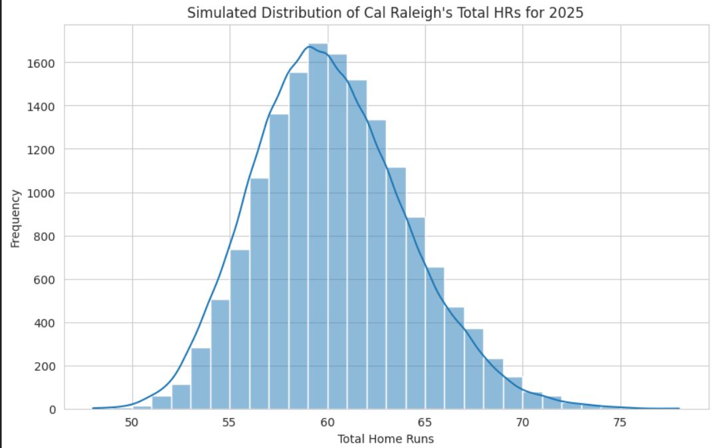
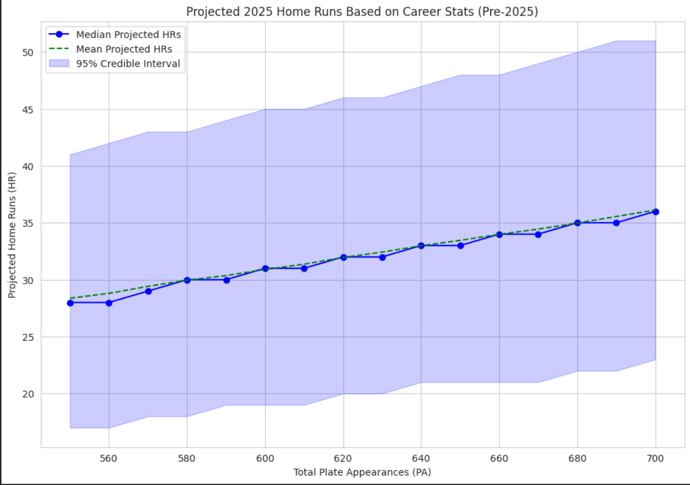
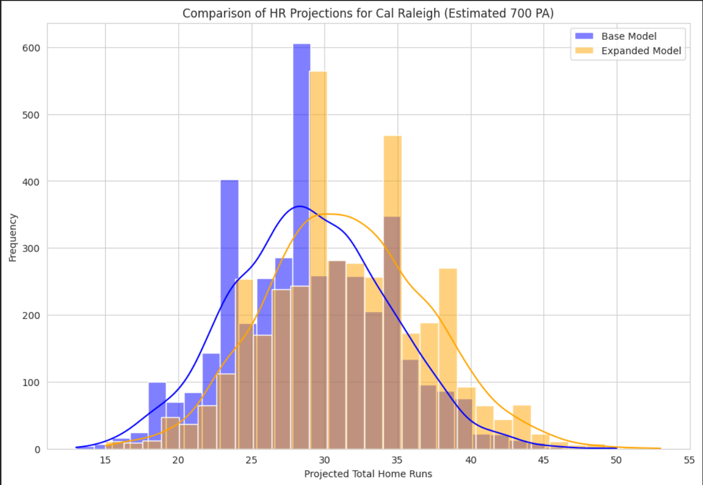

# cal-raleigh-hr-simulation
Simulating Cal Raleigh's home runs for the 2025 season

As of 2025-08-19, Cal Raleigh has hit 47 home runs in 123 games and 543 plate appearances. This project is aiming to use MCMC methods to simulate the distribution of the number of home runs Cal Raleigh could hit this year, using his previous batting statistics and statistics from similar players, in order to to put into context how impressive his season truly is.

The data is sourced from Fangraphs. It includes batting statistics of players from 2015-2024.

## Project Structure

cal-raleigh-hr-simulation/
├── .gitignore
├── LICENSE
├── README.md
├── pyproject.toml
├── requirements.txt
├── data/
│   ├── processed/
│   └── raw/
│       └── fangraphs-leaderboards.csv
├── notebooks/
└── src/
    ├── modeling.py
    ├── processing.py
    └── visualization.py

## Beta Binomial Projections

### 2025 Season Data (as of 2025-08-19)

### Pre-2025 Historical Data

## Hierarchical Models
Base Model: ISO, Barrel%, HardHit%
Enhanced Model: ISO, Barrel%, HardHit%, SLG, Med%, BB%, Age

