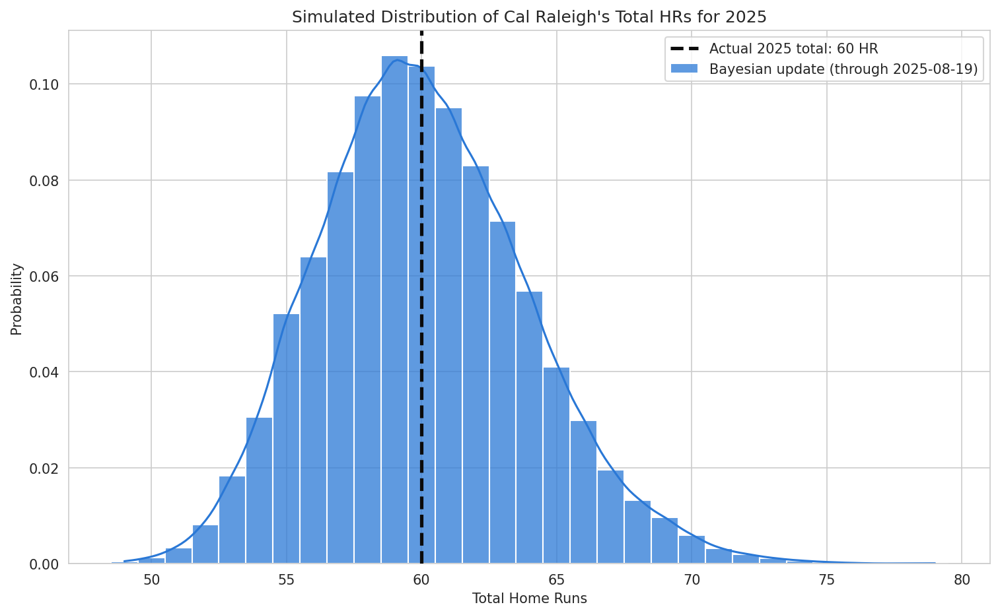
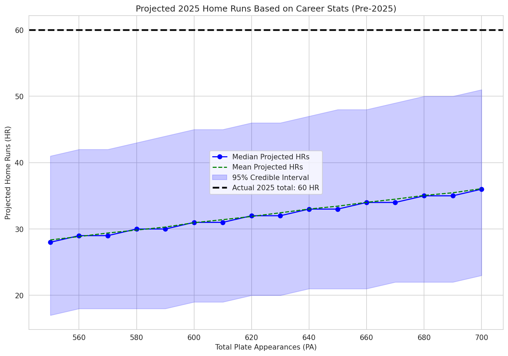
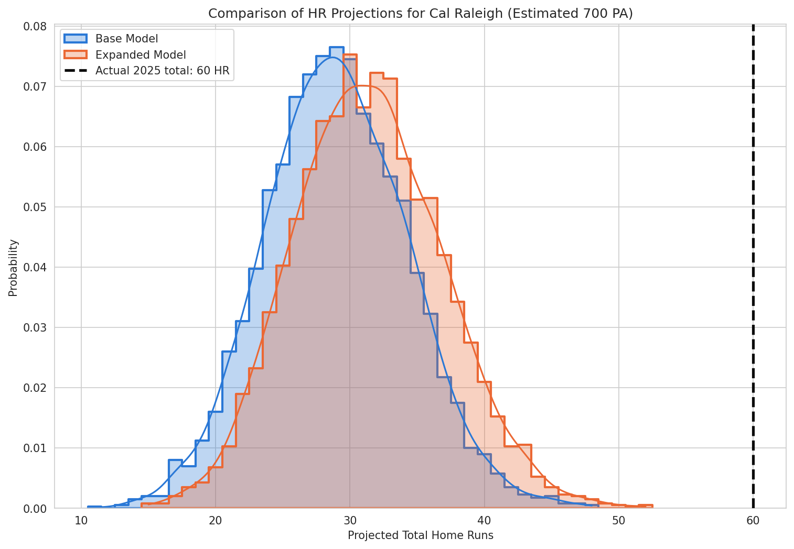
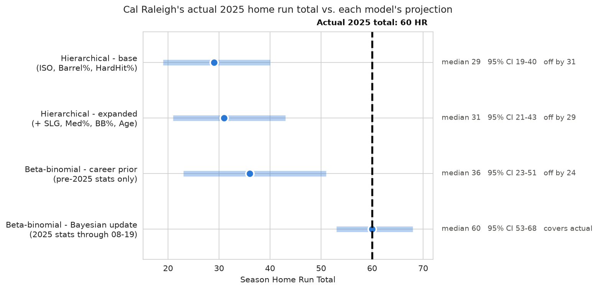

# cal-raleigh-hr-simulation
Simulating Cal Raleigh's home runs for the 2025 season

As of 2025-08-19, Cal Raleigh has hit 47 home runs in 123 games and 543 plate appearances. This project is aiming to use MCMC methods to simulate the distribution of the number of home runs Cal Raleigh could hit this year, using his previous batting statistics and statistics from similar players, in order to to put into context how impressive his season truly is.

The data is sourced from Fangraphs. It includes batting statistics of players from 2015-2024.

**How it ended:** Cal Raleigh finished 2025 with **60 home runs in 705 plate appearances over 159 games** — the most ever by a catcher and the most ever by a switch-hitter.

## Project Structure

cal-raleigh-hr-simulation/
├── .gitignore
├── LICENSE
├── README.md
├── pyproject.toml
├── requirements.txt
├── data/
│   ├── processed/
│   └── raw/
│       └── fangraphs-leaderboards.csv
├── notebooks/
│   ├── 01-beta-binomial.ipynb
│   ├── 02-hierarchical-model.ipynb
│   └── 03-actual-vs-predictions.ipynb
└── src/
    ├── modeling.py
    ├── processing.py
    └── visualization.py

Notebooks 01 and 02 write their posterior simulations to `data/processed/`, so
run them before notebook 03.

## Beta Binomial Projections

### 2025 Season Data (as of 2025-08-19)

### Pre-2025 Historical Data

## Hierarchical Models
Base Model: ISO, Barrel%, HardHit%
Enhanced Model: ISO, Barrel%, HardHit%, SLG, Med%, BB%, Age

## Actual Result vs. Projections

Simulated season-total distributions are plotted as probability mass functions —
each bar is P(HR = k) across the posterior draws — so the y-axis does not depend
on how many MCMC samples happened to be drawn.

| Model | Median | 95% CI | vs. actual 60 | P(HR ≥ 60) |
|---|---|---|---|---|
| Hierarchical — base (ISO, Barrel%, HardHit%) | 29 | 19–40 | off by 31 | 0.0000 |
| Hierarchical — expanded (+ SLG, Med%, BB%, Age) | 31 | 21–43 | off by 29 | 0.0000 |
| Beta-binomial — career prior (pre-2025 stats only) | 36 | 23–51 | off by 24 | 0.0027 |
| Beta-binomial — Bayesian update (2025 stats through 08-19) | **60** | 53–68 | **covers actual** | 0.5367 |

The three models that only saw pre-2025 information all put essentially zero
probability on a 60-homer season, which is the point: nothing in Raleigh's
career record or in comparable players' track records made 2025 look reachable.
Once his first 123 games of 2025 were folded into the likelihood, the
beta-binomial posterior landed on a median of exactly 60 with the actual total
near the centre of its credible interval.
